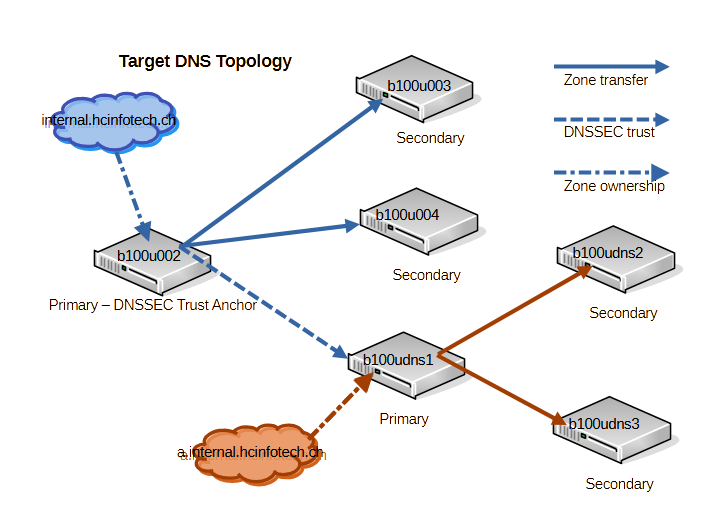

# DNS infrastructure setup on Ubuntu

This guide documents the installation and configuration of a three-node BIND9 nameserver setup on Ubuntu 25.04 (_Plucky Puffin_).  
All VMs use **full disk encryption at rest** and are deployed on a Proxmox cluster.

## 1. DNS landscape

### Virtual machines

| Hostname      | Role          | Location       |
| ------------- | ------------- | -------------- |
| **b100udns1** | Primary DNS   | Proxmox Node 1 |
| **b100udns2** | Secondary DNS | Proxmox Node 2 |
| **b100udns3** | Secondary DNS | Proxmox Node 3 |

### Topology


Process during the current reconfiguration module:

1. Configure newly installed nameservers as primary and secondaries for zone a.internal.hcinfotech.ch.
2. Change configuration of the current topology of internal.hcinfotech.ch to delegate responsibility to the new zone.

Final goal:



- After the complete network redesign, b100u002 with secondaries b100u003 and b100u004 assumes the authoritative role for top level domain internal.hcinfotech.ch
- It delegates responsibility to subdomains x.internal.hcinfotech.ch
- A, CNAME, MX and PTR records of internal.hcinfotech.ch are successive migrate to a new subdomain
- Finally internal.hcinfotech.ch contains only the DS recors of internal DNSSEC and the delegation to the subdomains

---

## 2. Installation

### Install BIND9

Standard Ubuntu/Debian package:

```bash
sudo apt update && sudo apt install -y bind9
```

Default configuration directory /etc/bind/

---

## 3. Primary nameserver configuration

The primary server is authoritative for all managed zones. If using dynamic updates or TSIG-protected zone transfers,
first complete the [dynamic DNS setup](../2.%20Add%20DDNS%20to%20current%20setup/README.md)

1. **Update** /etc/bind/named.conf

Add an include for the TSIG key file if dynamic updates or TSIG are used:

```conf
...
include "/etc/bind/ddns-signatures";  # file containing TSIG keys created with tsig-keygen
```

2. **Update** /etc/bind/named.conf.options

**Restrict access to internal networks**

```conf
acl internal {
  10.0.0.0/8;
};
...
options {
  allow-query { internal; };
  recursion yes;
  notify yes;
...
};
```

⚠️ **Don't forget semicolons**, missing them causes common configuration errors.

**Allow Notifications and Transfers to Secondaries**

```conf
allow-notify {
    ...
    10.1.51.82;  # secondary #1
  };

  allow-transfer {
    ...
    10.1.51.82;  # secondary #1
    key ddns-transfer-key;  # include only if TSIG-protected transfers are used
  };
};
```

Example: [named.conf.options](./config/subdomain-dns/primary/named.conf.options)

3. **Update** /etc/bind/named.conf.local

Define authoritative zones

```conf
zone "a.internal.hcinfotech.ch" IN {
  type primary;
  file "/etc/bind/a.internal.hcinfotech.ch.zone";
};

zone "51.1.10.in-addr.arpa" {
  type primary;
  file "/etc/bind/51.1.10.in-addr.arpa.zone";
};
```

Example: [named.conf.local](./config/subdomain-dns/primary/named.conf.local)

4. **Create** zone files for a.internal.hcinfotech.ch

NOTE: Don't forget to update the serial numbers, whenever you change one of the zone files.

4.1 **Create forward lookup /etc/bind/a.internal.hcinfotech.ch.zone**

```conf
$TTL 2d

$ORIGIN a.internal.hcinfotech.ch.

@         IN    SOA     ns1.a.internal.hcinfotech.ch. admin.internal.hcinfotech.ch. (
                        2025091800      ; serial
                        12h             ; refresh
                        15m             ; retry
                        3w              ; expire
                        2h              ; minimum ttl
                        )

;NAME       TTL   CLASS   TYPE    Resource Record
                  IN      NS      ns1.a.internal.hcinfotech.ch.
                  IN      NS      ns2.a.internal.hcinfotech.ch.
                  IN      NS      ns3.a.internal.hcinfotech.ch.

; Name Servers
ns1               IN      A       10.1.51.81
ns2               IN      A       10.1.51.82
ns3               IN      A       10.1.51.83

@         3600    IN      A       10.1.51.135
b100udns1 3600    IN      A       10.1.51.81
b100udns2 3600    IN      A       10.1.51.82
b100udns3 3600    IN      A       10.1.51.83
b100u013  3600    IN      A       10.1.51.45
```

4.2 **Create the reverse lookup /etc/bind/51.1.10.in-addr.arpa.zone**

```conf
$TTL  2d
$ORIGIN   51.1.10.IN-ADDR.ARPA.


@         IN      SOA     ns1.a.internal.hcinfotech.ch  admin.internal.hcinfotech.ch. (
                          2025091701    ; serial
                          12h           ; refresh
                          15m           ; retry
                          3w            ; expire
                          2h            ; minimum ttl
                          )

;NAME       TTL   CLASS   TYPE    Resource Record
                  IN      NS      ns1.a.internal.hcinfotech.ch.
                  IN      NS      ns2.a.internal.hcinfotech.ch.
                  IN      NS      ns3.a.internal.hcinfotech.ch.

135 3600 IN PTR t.st.hcinfotech.ch.
81 3600 IN PTR b100dns1.a.internal.hcinfotech.ch.
82 3600 IN PTR b100dns2.a.internal.hcinfotech.ch.
83 3600 IN PTR b100dns3.a.internal.hcinfotech.ch.
45 3600 IN PTR b100u013.a.internal.hcinfotech.ch.
```

5. **Validate configuration**

```bash
sudo named-checkconf
sudo named-checkzone a.internal.hcinfotech.ch /var/lib/bind/a.internal.hcinfotech.ch.zone
```

6. **Start and verify named service**

```bash
sudo systemctl start named
systemctl status named
sudo journalctl -eu named
```

---

## 4. Secondary nameserver configuration

The secondary servers receive zone data from the primary using AXFR transfers.

1. **Create** /etc/bind/ddns-signatures, only if TSIG-protected transfers are used.

```conf
key "ddns-transfer-key" {
  algorithm hmac-sha512;
  secret "xxxxx...";   # TSIG secret from primary
};

server 10.1.50.32 {           # IP of primary nameserver
  keys { ddns-transfer-key; };
};
```

Set permissions:

```bash
sudo chown root:bind /etc/bind/ddns-signatures
sudo chmod g+r,o-rwx /etc/bind/ddns-signatures
```

Add include statement to /etc/bind/named.conf:

```conf
...
include "/etc/bind/ddns-signatures";
...
```

2. **Update** /etc/bind/named.conf.options
   Restrict access as for the primary:

```conf
acl internal {
  10.0.0.0/8;
};

options {
  allow-query { internal; };
  recursion yes;
};
```

Example: [named.conf.options](./config/subdomain-dns/secondary/named.conf.options)

3. **Update** /etc/bind/named.conf.local

Add zones where this server is secondary:

```conf
zone "a.internal.hcinfotech.ch" IN {
  type secondary;
  file "/var/lib/bind/a.internal.hcinfotech.ch.zone"; # must be directory writable by named. Apparmor protects /etc/bind
  primaries {
    10.1.51.81;
  };
};

// zone file for the reverse lookup
zone "51.1.10.in-addr.arpa" {
  type secondary;
  file "/var/lib/bind/51.1.10.in-addr.arpa.zone";
  primaries {
    10.1.51.81;
  };
];
```

Example: [named.conf.local](./config/subdomain-dns/secondary/named.conf.local)

4. **Validate and start named service**

```bash
sudo named-checkconf
sudo systemctl start named
systemctl status named
sudo journalctl -eu named

dig @10.1.51.82 b100udns1.a.internal.hcinfotech.ch A
```

---

## 5. Configure zone delegation on internal.hcinfotech.ch

### 5.1 Primary nameserver b100u002

1. Add the delegation nameservers and the glue records to internal.hcinfotech.ch zone files

1.1 **Update** /etc/bind/internal.hcinfotech.ch

Add NS records and the glue records for the a.internal.hcinfotech.ch nameservers

```code
$TTL 2d

$ORIGIN internal.hcinfotech.ch.

@         IN    SOA     ns1.internal.hcinfotech.ch. admin.internal.hcinfotech.ch. (
                        2025091803      ; serial
...
; Name Servers
ns1                       IN      A       10.1.50.32
ns2                       IN      A       10.1.50.33
ns3                       IN      A       10.1.50.34
...
; Delegation for child zone
a.internal.hcinfotech.ch.      IN      NS      ns1.a.internal.hcinfotech.ch.
a.internal.hcinfotech.ch.      IN      NS      ns2.a.internal.hcinfotech.ch.
a.internal.hcinfotech.ch.      IN      NS      ns3.a.internal.hcinfotech.ch.

; Glue records for in-zone nameservers
ns1.a.internal.hcinfotech.ch.  IN      A       10.1.51.81
ns2.a.internal.hcinfotech.ch.  IN      A       10.1.51.82
ns3.a.internal.hcinfotech.ch.  IN      A       10.1.51.83
...
@  3600 IN A 10.1.50.135
b100caweb1 3600 IN A 10.1.50.225
b100caweb2 3600 IN A 10.1.50.250
b100caweb3 3600 IN A 10.1.50.110
b100ldap 3600 IN A 10.1.50.63
...
```

Example: [internal.hcinfotech.ch.zone](./config/primary-dns/internal.hcinfotech.ch.zone)

2. **Update** /etc/bind/named.conf.options

Remove forwarders, transfer and notify statements from the file. You need to create views for
internal and external lookups, else every lookup for the delegated zone will go all the way to the root .
of the DNS tree and the lookup will fail because the internal zones are not maintained in your actual
external domain

```conf
acl internal {
  10.0.0.0/8;
};

options {
        directory "/var/cache/bind";

        // If there is a firewall between you and nameservers you want
        // to talk to, you may need to fix the firewall to allow multiple
        // ports to talk.  See http://www.kb.cert.org/vuls/id/800113

        // If your ISP provided one or more IP addresses for stable
        // nameservers, you probably want to use them as forwarders.
        // Uncomment the following block, and insert the addresses replacing
        // the all-0's placeholder.

        //========================================================================
        // If BIND logs error messages about the root key being expired,
        // you will need to update your keys.  See https://www.isc.org/bind-keys
        //========================================================================

         // important else revers lookup will not be forwarded internally
        empty-zones-enable no;


        dnssec-validation auto;

        listen-on-v6 { any; };
};
```

NOTE: Add 'empty-zones-enabled no' else the reverse lookup is sent to the internet root servers.

Example: [named.conf.options](./config/primary-dns/named.conf.options)

3. **Update** /etc/bind/named.conf.local

Create views for internal and external lookup. Add the forwarded nameserver for the delegated zones

```code
view "internal" {
  match-clients { internal; };
  recursion yes;

  // Do NOT forward queries for internal clients — resolve locally
  allow-query { internal; };
  allow-notify {
    10.1.50.32;
    10.1.50.33;
    10.1.50.34;
  };
  allow-transfer {
    10.1.50.32;
    10.1.50.33;
    10.1.50.34;
  };
  notify yes;

  zone "internal.hcinfotech.ch" IN {
    type primary;
    file "/etc/bind/internal.hcinfotech.ch.zone";
  };

  // Forward zone for child (delegated) so queries go directly to child NS
  zone "a.internal.hcinfotech.ch" IN {
    type forward;
    forwarders { 10.1.51.81; 10.1.51.82; 10.1.51.83; };
  };

  // Reverse zone
  zone "50.1.10.in-addr.arpa" {
    type primary;
    file "/etc/bind/50.1.10.in-addr.arpa.zone";
  };

  // Reverse zone
  zone "51.1.10.in-addr.arpa" {
    type forward;
    forwarders { 10.1.51.81; 10.1.51.82; 10.1.51.83; };
  };
};

view "external" {
  match-clients { any; };
  recursion yes;
  forwarders {
    1.1.1.1; # Cloudflare
    1.0.0.1; # Cloudflare secondary
  };
};
```

I use CloudFlare as external forwarders. CloudFlare provides the best performance for my area. You can
see the nameservers with the best performance with service [dnsspeddtest.online](https://dnsspeedtest.online/) for example.

Example: [named.conf.local](./config/primary-dns/named.conf.local)

4. **Update** /etc/bind/named.conf.default-zone

You need to create a view for the default zone too. If any zone is part of a view, then all
the zones need to be in views.

```conf
// prime the server with knowledge of the root servers
view "default" {
  match-clients { internal; };
  recursion yes;
  zone "." {
    type hint;
    file "/usr/share/dns/root.hints";
  };

  // be authoritative for the localhost forward and reverse zones, and for
  // broadcast zones as per RFC 1912

  zone "localhost" {
    type master;
    file "/etc/bind/db.local";
  };

  zone "127.in-addr.arpa" {
    type master;
    file "/etc/bind/db.127";
  };

  zone "0.in-addr.arpa" {
    type master;
    file "/etc/bind/db.0";
  };

  zone "255.in-addr.arpa" {
    type master;
    file "/etc/bind/db.255";
  };
};
```

Example: [named.conf.default-zone](./config/primary-dns/named.conf.default-zones)

5. Validate and restart named

```bash
sudo named-checkconf
sudo named-checkzone internal.hcinfotech.ch /etc/bind/internal.hcinfotech.ch.zone
sudo systemctl restart named
```

6. Repeat the steps on all the secondary nameservers

- [named.conf.options](./config/secondary-dns/named.conf.options)
- [named.conf.local](./config/secondary-dns/named.conf.local)
- [named.conf.default-zones](./config/secondary-dns/named.conf.default-zones)

---

## 6. Security notes

- **Never commit TSIG secrets** or ddns-signatures to a public repo.
- Restrict ACLs to trusted networks only.
- Rotate TSIG keys periodically and store them securely.
- Store dynamically updated zones in /var/lib/bind due to AppArmor restrictions.

---

## 7. Logging and Monitoring (Recommended)

**Enable query logging**
Edit /etc/vind/named.conf.options

```conf
logging {
  channel query_log {
    file "/var/log/named/query.log" versions 3 size 10m;
    severity info;
    print-time yes;
  };
  category queries { query_log; };
};
```

Create the log directory and restart:

```bash
sudo mkdir -p /var/log/named
sudo chown bind:bind /var/log/named
sudo systemctl restart named
```

Tail logs live:

```bash
sudo tail -f /var/log/named/query.log
```

**Monitor zone transfer failures**

```bash
sudo journalctl -u named | grep "Transfer"
```

For production environments, integrate alerts with Prometheus, Zabbix, or Nagios.

**Log rotation**

Create /etc/logrotate.d/bind:

```conf
/var/log/named/*.log {
  daily
  rotate 7
  compress
  missingok
  notifempty
  create 0640 bind bind
  sharedscripts
  postrotate
    systemctl reload named > /dev/null
  endscript
}
```

Example: [logrotate.d/bind](./config/sample-logrotate.d-bind)

---

## 8. Verification

To confirm replication works:

```bash
dig @b100udns2 tst.hcinfotech.ch AXFR
```

Use the set_HMAC alias to set the TSIG key, if the landscape uses TSIG-transfer.

You should see the full zone transferred from the primary.
Repeat with b100udns3 to verify both secondaries are in sync.

---

## 9. Troubleshooting

| Symptom               | Likely cause                    | Fix                                 |
| --------------------- | ------------------------------- | ----------------------------------- |
| named-checkconf fails | Missing ;                       | Double-check all config files       |
| named fails to start  | Wrong permissions on zone files | Use /var/lib/bind + chown root:bind |
| Zone not transferring | IP mismatch or missing key      | Verify allow-transfer and TSIG key  |
| dig AXFR → REFUSED    | No AXFR permission              | Check allow-transfer stanza         |
| SERVFAIL              | AppArmor preventing writes      | Move zones to /var/lib/bind         |
| Key errors            | Wrong TSIG secret/algorithm     | Re-run tsig-keygen, sync both ends  |

**Debug commands**

```bash
sudo named-checkconf
sudo named-checkzone tst.hcinfotech.ch /var/lib/bind/tst.hcinfotech.ch.zone
sudo journalctl -fu named
dig @b100udns1 tst.hcinfotech.ch AXFR -y hmac-sha512:ddns-transfer-key:<base64_secret>
```

**Delegation failures:**

1. Delegation nameserver resolution

```bash
# Show whether parent currently claims any delegation (empty = no delegation)
dig @10.1.50.32 a.internal.hcinfotech.ch. NS +short
```

Expected output:

```code
ns6.a.internal.hcinfotech.ch.
ns5.a.internal.hcinfotech.ch.
ns4.a.internal.hcinfotech.ch.
```

2. Zone file syntax check

```bash
sudo named-checkzone internal.hcinfotech.ch /etc/bind/internal.hcinfotech.ch.zone
```

Increment the serial number in the zonefile and then:

```bash
sudo rndc reload tst.hcinfotech.ch
```

Check logs if errors:

```bash
sudo journalctl -u bind9 -n 200
```

3. Check that child servers are authorative:

```bash
dig @10.1.51.81 a.internal.hcinfotech.ch. SOA +short
dig @10.1.51.82 a.internal.hcinfotech.ch. SOA +short
dig @10.1.51.82 a.internal.hcinfotech.ch. SOA +short
```

Expected output:

```code
ns4.a.internal.hcinfotech.ch. info.hcinfotech.ch. 2025091800 43200 900 1814400 7200
```

---

This completes the setup of a secure, monitored, and redundant BIND9 DNS infrastructure on Ubuntu.
