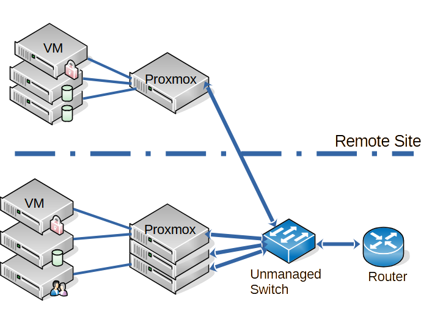
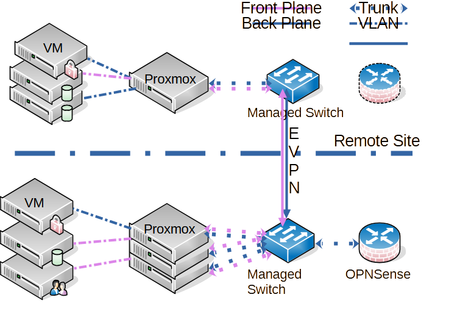

# Network Reconfiguration: Dynamic DNS and TSIG

This repository documents the reconfiguration of a Proxmox-based lab network to simulate a cloud-provider-like environment.  
The first step comprises enabling **secure Dynamic DNS** by using **TSIG keys** for authenticated zone transfers and updates.

---

## 1. Current compared to target configuration

### Current setup

- 3-node Proxmox cluster (HP Proliant DL360 Gen8)
- 1 standalone Proxmox node simulating a distant region
- Unmanaged switch, bonded NIC pairs
- IPv4 only



---

### Target setup

- Same Proxmox nodes
- Managed switches with VLAN support
- OPNSense router/firewall for VLAN separation and routing
- IPv6 for internal addressing
- Dynamic DNS with TSIG authentication



---

## 2. Dynamic DNS setup

### Generate TSIG keys

````bash
# Zone Transfer Key
tsig-keygen -a hmac-sha512 ddns-transfer-key | sudo tee -a /etc/bind/ddns-signatures 1>/dev/null 2>&1

# Zone Update Key
tsig-keygen -a hmac-sha512 ddns-update-key | sudo tee -a /etc/bind/ddns-signatures 1>/dev/null 2>&1

Set correct ownership and permissions:

```bash
sudo chown root:bind /etc/bind/ddns-signatures
sudo chmod g-w,o-rwx /etc/bind/ddns-signatures
````

Store keys securely in a password manager or Vault.

- Zone transfers → require ddns-transfer-key
- Dynamic updates → require ddns-update-key

---

## 3. Configure bind

Include the TSIG keys in /etc/bind/named.conf:

```bash
include "/etc/bind/ddns-signatures";
```

Require signed zone transfers in namde.conf.options:

```bash
allow-transfer {
    192.0.2.10;      # example secondary DNS
    key ddns-transfer-key;
};
```

⚠️ Don’t forget semicolons, missing them causes a common error.

Restart bind:

```bash
sudo systemctl restart named
```

---

## 4. Zone Transfers with dig

Create a shell alias to load credentials without exposing them in the shell history:

```bash
alias set_HMAC='read -i "hmac-sha512 " -ep "Encrypt. Algorithm: " HMAC_ALG; \
read -i "ddns-update-key " -ep "DDNS User: " HMAC_USER; \
read -sep "DDNS Password: " HMAC_PASSWD; \
HMAC=\${HMAC_ALG}:\${HMAC_USER}:\${HMAC_PASSWD}'
```

Use the exported variable $HMAC with dig and nsupdate.

Example zone transfer:

```bash
dig @ns1.tst.hcinfotech.ch +noall +answer tst.hcinfotech.ch -y $HMAC -t AXFR \
| grep -E $'[\t| ](A|CNAME|MX)[\t| ]'
```

Explanation:

- Connects to the primary nameserver for zone tst.hcinfotech.ch
- Initiates an authenticated AXFR zone transfer
- Filters for A, CNAME, and MX records

---

## 5. Configure the secondary name servers to use the same key for transfers

Securely copy file /etc/bind/ddns-signatures to the secondary DNS servers

Add a section indicating the primary name server after the transfer key in file /etc/bind/ddns-signatures

```bash
key "ddns-transfer-key" {
    algorithm hmac-sha512;
    secret "Alongandverysecretassphrase";
};
server 10.1.50.32 {   # example ip of primary name server
    keys {
        ddns-transfer-key;
    };
};
```

You can delete key ddns-update-key from the file on the secondary nameserver.

Restart named on secondary

```bash
sudo systemctl restart named
```

---

## 6. Configure the primary nameserver for dynamic updates

### 6.1 Prepare the transfer files for the zones

Prepare the files for the transfer by nsupdate ahead of time. The zone resolution
is unavailable until nsupdate has updated the zones, after placing the empty zone stubs
into /var/lib/bind and reloading named configuration.

The transfer files use the following format:

```bash
server 10.1.50.32          # IP address of primary name server
zone tst.hcinfotech.ch             # the zone to be transferred
update add server1.tst.hcinfotech.ch 3600 IN A 10.1.50.135
...
update add server50.tst.hcinfotech.ch 3600 IN A 10.1.50.211
send                         # signal nsupdate to start the transfer
```

Transfer of the reverse lookup follows the same format. Zone replaced by the
reverse lookup zone (e.g. 50.1.10.in-addr.arpa).
'update add' command adding the reverse lookup entries
(e.g. 135.50.1.10.in-addr.arpa 3600 IN PTR xxx.tst.hcinfotech.ch.)

You could use something such as the following scripts to create these files.

```bash
echo "server 10.1.50.32" | sudo tee /etc/bind/tst.hcinfotech.ch.zone.transfer
echo "zone tst.hcinfotech.ch." | sudo tee -a /etc/bind/tst.hcinfotech.ch.zone.transfer
dig @ns1.tst.hcinfotech.ch +noall +answer tst.hcinfotech.ch -y $HMAC -t AXFR \
| grep -E $'[\t| ](A|CNAME|MX)[\t| ]' \
| while read LINE; do \
    echo "update add ${LINE}" | sudo tee -a /etc/bind/tst.hcinfotech.ch.zone.transfer \
  done
echo "send" | sudo tee -a /etc/bind/tst.hcinfotech.ch.zone.transfer
```

Similar for the transfer of the reverse lookup zone

```bash
echo "server 10.1.50.32" | sudo tee /etc/bind/10.1.50.zone.transfer
echo "zone 50.1.10.in-addr.arpa" | sudo tee -a /etc/bind/10.1.50.zone.transfer
dig @ns1.tst.hcinfotech.ch +noall +answer 50.1.10.in-addr.arpa -y $HMAC -t AXFR \
| grep -E $'[\t| ](PTR)[\t| ]' \
| while read LINE; do \
    echo "update add ${LINE}" | sudo tee -a /etc/bind/10.1.50.zone.transfer \
  done
echo "send" | sudo tee -a /etc/bind/10.1.50.zone.transfer
```

Update /etc/bind/named.conf.local on the primary name server and add the following section
to any zone prepared for dynamical update:

```bash
update-policy {
 grant ddns-update-key zonesub ANY;
};
```

AppArmor prevents named from updating files in /etc/bind. The zone file needs to be stashed in
directory /var/lib/bind/ in order for it to be updated by named.

Example zone entry in /etc/bind/named.conf.local:

```bash
zone "tst.hcinfotech.ch" IN {
  type primary;
  file "/var/lib/bind/tst.hcinfotech.ch.zone";
  update-policy {
    grant ddns-update-key zonesub ANY;
  };
};
```

### 6.2 Create the initial zone files

Create the initial zone file in /var/lib/bind/. The zone file needs to contain the SOA record,
and the NS records of the name servers. nsupdate loads everything else dynamically.

Example initial zone file /var/lib/bind/tst.hcinfotech.ch.zone:

```bash
$TTL 172800     ; 2 days
$ORIGIN tst.hcinfotech.ch.
@                 IN SOA  ns1.tst.hcinfotech.ch. info.tst.hcinfotech.ch. (
                                2025091000 ; serial
                                43200      ; refresh (12 hours)
                                900        ; retry (15 minutes)
                                1814400    ; expire (3 weeks)
                                7200       ; minimum (2 hours)
                                )
;NAME       TTL   CLASS   TYPE    Resource Record
                  IN      NS      ns1.tst.hcinfotech.ch

;Name Servers
ns1               IN      A       10.1.50.32
```

Here increase the serial number to signal the secondary servers to re-transfer the zone.
Create a similar zone file for the reverse lookup.

### 6.3 Change the configuration in /etc/bind/named.conf.local

Update /etc/bind/named.conf.local on the primary name server and add the following section
to any zone prepared for dynamical update:

```bash
update-policy {
 grant ddns-update-key zonesub ANY;
};
```

AppArmor prevents named from updating files in /etc/bind. The zone file needs to be stashed in
directory /var/lib/bind/ in order for it to be updated by named.

Example zone entry in /etc/bind/named.conf.local:

```bash
zone "tst.hcinfotech.ch" IN {
  type primary;
  file "/var/lib/bind/tst.hcinfotech.ch.zone";
  update-policy {
    grant ddns-update-key zonesub ANY;
  };
};
```

Restart named

```bash
sudo systemctl restart named
```

---

## 7. Transfer the currently existing zone to the new dynamic zone

Use nsupdate to create the new zone

```bash
nsupdate -y $HMAC ~/tst.hcinfotech.ch.zone.transfer
```

This updates all the records of the file into the new zone. It creates a journal file
tst.hcinfotech.ch.zone.jnl in /var/lib/bind and it notifies all the secondary name servers of
the changed zone.

Manage this zone only with nsupdate, as manually changing the zone
file causes conflicts and inconsistencies.

## 8. Dynamic updates with nsupdate

### Add a record

update.txt:

```bash
server ns1.tst.hcinfotech.ch
zone tst.hcinfotech.ch
update add test.tst.hcinfotech.ch. 3600 IN AAAA 2001:db8::1234
send
```

Run:

```bash
nsupdate -y $HMAC update.txt
```

### Delete a record

update.txt:

```bash
server ns1.tst.hcinfotech.ch
zone tst.hcinfotech.ch
update delete test.tst.hcinfotech.ch. IN AAAA
send
```

Run:

```bash
nsupdate -y $HMAC update.txt
```

Verify:

```bash
dig @ns1.tst.hcinfotech.ch test.tst.hcinfotech.ch AAAA
```

I'm temporarily using the following API [bind-rest-api](https://gitlab.com/jaytuck/bind-rest-api.git), based on dnspython. It serves as a start,
but it needs work in part of the capability and with security.

---

## 9. DNSSEC configuration

DNSSEC (DNS Security Extension) provides cryptographic authentication of DNS information.
A secure primary zone signs the transferred records, using private/public
key pairs. The secondary nameservers can therefor verify that the data they receive
originated at the primary for the zone.

### 9.1 Generating the keys

The zone requires a zone signing key (ZSK), and a key signing key (KSK). dnssec-keygen
creates both of these keys. Place the keys in the same location as the zone files.
Here in directory /var/lib/bind/ for dynamically updated zones.

```bash
sudo -u bind dnssec-keygen -a ECDSAP256SHA256 -n ZONE -K /var/lib/bind/ tst.hcinfotech.ch
sudo -u bind dnssec-keygen -f KSK -a ECDSAP256SHA256 -n ZONE -K /var/lib/bind/ tst.hcinfotech.ch
```

Add the public keys contained in files Ktst.hcinfotech.ch.+....key in /var/lib/bind/ to the zone using nsupdate

```bash
nsupdate -y $HMAC
> server ns1.tst.hcinfotech.ch
> zone tst.hcinfotech.ch
> ttl 3600
> update add tst.hcinfotech.ch. IN DNSKEY 256 3 13 ab8df9.....a3d2==
> update add tst.hcinfotech.ch. IN DNSKEY 256 3 13 f6b78d.....a9ef==
> send
```

### 9.2 Sign the zone by using dnssec-signzone

```bash
sudo -u bind dnssec-signzone -3 $(openssl rand -hex 8) -S -A -N INCREMENT -K /var/lib/bind -o tst.hcinfotech.ch. -t tst.hcinfotech.ch.zone
```

- -3 NSEC3 $(openssl rand -hex 8) creates a 16 character salt
- -S smartly finds the keys in the specified key directory
- -o the zone to be signed
- -t the zone file
- -A NSEC3 optout
- -N increment the SOA serial

Signing creates new zone file tst.hcinfotech.ch.zone.signed

Update /etc/bind/named.conf.local and replace statement file "/var/lib/bind/tst.hcinfotech.ch.zone" with
"/var/lib/bind/tst.hcinfotech.ch.zone.signed"

Validate:

```bash
sudo -u bind named-checkconf
sudo -u bind named-checkzone tst.hcinfotech.ch /var/lib/bind/tst.hcinfotech.ch.zone.signed
```

### 9.3 Update the secondary resolvers with the new trust anchor

KSK public key comprises the trust anchor.

Update /etc/bind/named.conf.options on the secondaries to add the trust anchor

```bash
...
options {
    dnssec-validation yes;
    ...
};

trust-anchors {
    "tst.hcinfotech.ch" static-key 257 3 13 "...the public key...==";
};
```

Reload named configuration

```bash
sudo systemctl reload named
```

---

## 10. Security best practices

🔑 Key Management

- Rotate keys regularly
- Separate keys for transfer compared to update
- Revoke unused keys immediately
- Store keys in Vault or KeePass

🔒 Access Control

- Restrict allow-transfer and allow-update to trusted IPs and keys
- Avoid using shared update keys across clients

🧩 Operational Hardening

- Run named as a non-privileged user
- Restrict key file permissions (640)
- Disable dynamic updates on static zones

📜 Logging and Auditing

- Enable query/update logging in bind
- Periodically review logs for anomalies
- Optionally integrate with Security Information and Event Management (SIEM)

🧪 Testing

- Always validate updates with dig
- Test failure cases (wrong key, expired TTL, etc.)

---

## 11. Next steps

This Dynamic DNS configuration is the foundation for broader reconfiguration:

1. Migrate to IPv6 – replace IPv4 addressing with IPv6
2. Introduce Managed Switches – VLAN support for tenant/service isolation
3. Deploy OPNSense – central routing, firewalling, VLAN separation
4. Adopt Software-Defined Networking (SDN) principles – prepare for multitenant cloud simulation

I document each step in follow-up guides and YouTube walk-throughs.
