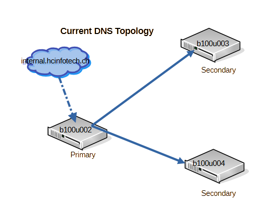

# DNS infrastructure – deep dive setup

This series of guides documents the process of rebuilding and securing the DNS infrastructure for the HCInfoTech lab environment.  
The goal is to move from a simple, static configuration to a production-like setup with:

- A properly structured **primary/secondary nameserver** architecture
- **Dynamic DNS updates** and secured **zone transfers** using TSIG
- **DNSSEC signing** with automated key management and re-signing

The series is based on the same principles that a real-world production migration would follow —  
minimizing disruption, validating every step, and using automation where possible.

---

## 🌐 Current vs. Target Architecture

**Current State:**  
_A simple single-zone setup with unencrypted transfers and static zone files._

**Target State:**  
_A secure, automated DNS infrastructure with TSIG-protected zone transfers, dynamic updates, and DNSSEC._

---

## 📑 Guides

- **[Part 1. New DNS Installation](./1.%20New%20DNS%20Infrastructure/README.md)**
  Installation of BIND9 on Ubuntu 25.04, configuration of primary and secondary nameservers, ACLs, forwarders, and base zone setup.

- **[Part 2. Dynamic DNS & TSIG](./2.%20Add%20DDNS%20to%20current%20setup/README.md)**  
  Securing zone transfers and updates using TSIG, enabling dynamic DNS updates, and validating secure zone replication.

- **[Part 3. DNSSEC Setup & Automation](./3.%20DNSSEC%20Configuration/README.md)**  
  Enabling DNSSEC, signing zones, publishing DS records, and automating ZSK rollover and re-signing.

---

## 🎯 Purpose

This exercise is part of a larger network reconfiguration project to simulate a production-grade environment  
with IPv6 support, VLAN isolation, and automated infrastructure management.  
By following this series, you can replicate a secure and maintainable DNS setup in your own lab.

---

🔗 **Final Summary**
See [Summary](./SUMMARY.md) for the high-level overview and lessons learned after completing the migration.
