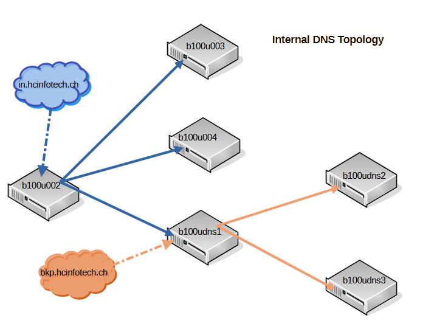

# DNS infrastructure setup on Ubuntu

This guide documents the installation and configuration of a three-node BIND9 nameserver setup on Ubuntu 25.04 (_Plucky Puffin_).  
All VMs use **full disk encryption at rest** and are deployed on a Proxmox cluster.

## 1. DNS landscape

### Virtual machines

| Hostname      | Role          | Location       |
| ------------- | ------------- | -------------- |
| **b100udns1** | Primary DNS   | Proxmox Node 1 |
| **b100udns2** | Secondary DNS | Proxmox Node 2 |
| **b100udns3** | Secondary DNS | Proxmox Node 3 |

### Topology



Configure newly installed nameservers as secondaries for the current domain in.hcinfotech.ch. b100udns1
assumes the role of primary for all newly created zones and transfers them to b100udns2
and b100udns2.

Final goal:

- After the complete network redesign, b100udns1 assumes the authoritative role for in.hcinfotech.ch
- Retire the old DNS infrastructure (b100u002, b100u003 and b100u004)

---

## 2. Installation

### Install BIND9

Standard Ubuntu/Debian package:

```bash
sudo apt update && sudo apt install -y bind9
```

Default configuration directory /etc/bind/

---

## 3. Primary nameserver configuration

The primary server is authoritative for all managed zones. If using dynamic updates or TSIG-protected zone transfers,
first complete the [dynamic DNS setup](../reconf-ddns-current-setup/README.md)

**Update** /etc/bind/named.conf

Add an include for the TSIG key file if dynamic updates or TSIG are used:

```bash
...
include "/etc/bind/ddns-signatures";  # file containing TSIG keys created with tsig-keygen
```

**Update** /etc/bind/named.conf.options

**Restrict access to internal networks**

```bash
acl internal {
  192.168.1.0/24;
  10.5.20.0/24;
};
...
options {
  allow-query { internal; };
  recursion yes;
  notify yes;
...
};
```

⚠️ **Don't forget semicolons**, missing them causes common configuration errors.

**Configure forwarders**

```bash
forwarders {
    8.8.8.8;  # Google DNS
    1.1.1.1;  # Cloudflare DNS
  };
```

**Allow Notifications and Transfers to Secondaries**

```bash
allow-notify {
    192.168.1.35;  # secondary #1
    192.168.5.68;  # secondary #2
  };

  allow-transfer {
    192.168.1.35;
    192.168.5.68;
    key ddns-transfer-key;  # include only if TSIG-protected transfers are used
  };
};
```

Example: [named.conf.options](./config/primary-dns/sample.named.conf.options)

**Update** /etc/bind/named.conf.local

Define authoritative zones

```bash
zone "example.com" IN {
  type primary;
  file "/var/lib/bind/example.com.zone";   # must be in /var/lib/bind if dynamic updates are enabled
  allow-transfer {
    192.168.1.35;                           # secondary nameservers
    192.168.5.68;
    key ddns-transfer-key;                  # only here if TSIG-protected transfers are configured
  };
  update-policy {                           # only present if dynamic zone updates are configurd
    grant ddns-update-key zonesub ANY;
  };
};
```

Example:¨[named.conf.local](./config/primary-dns/sample.named.conf.local)

**Validate configuration**

```bash
sudo named-checkconf
sudo named-checkzone example.com /var/lib/bind/example.com.zone
```

**Start and verify named service**

```bash
sudo systemctl start named
systemctl status named
sudo journalctl -eu named
```

---

## 4. Secondary nameserver configuration

The secondary servers receive zone data from the primary using AXFR transfers.

**Create** /etc/bind/ddns-signatures

If TSIG-protected transfers are used:

```bash
key "ddns-transfer-key" {
  algorithm hmac-sha512;
  secret "xxxxx...";   # TSIG secret from primary
};

server 192.168.1.20 {           # IP of primary nameserver
  keys { ddns-transfer-key; };
};
```

Set permissions:

```bash
sudo chown root:bind /etc/bind/ddns-signatures
sudo chmod g+r,o-rwx /etc/bind/ddns-signatures
```

Add include statement to /etc/bind/named.conf:

```bash
...
include "/etc/bind/ddns-signatures";
...
```

**Update** /etc/bind/named.conf.options
Restrict access and configure forwarders as for the primary:

```bash
acl internal {
  192.168.1.0/24;
  10.5.20.0/24;
};

options {
  allow-query { internal; };
  recursion yes;

  forwarders {
    8.8.8.8;
    1.1.1.1;
  };
};
```

Example: [named.conf.options](./config/secondary-dns/sample.named.conf.options)

**Update** /etc/bind/named.conf.local

Add zones where this server is secondary:

```bash
zone "example.com" IN {
  type secondary;
  file "/var/lib/bind/example.com.zone";  # must be writable by named, AppArmor restricts /etc/bind
  primaries {
    192.168.1.20;  # IP of primary nameserver
  };
};
```

**Validate and start named service**

```bash
sudo named-checkconf
sudo systemctl start named
systemctl status named
sudo journalctl -eu named
```

---

## 5. Security notes

- **Never commit TSIG secrets** or ddns-signatures to a public repo.
- Restrict ACLs to trusted networks only.
- Rotate TSIG keys periodically and store them securely.
- Store dynamically updated zones in /var/lib/bind due to AppArmor restrictions.

---

## 6. Logging and Monitoring (Recommended)

**Enable query logging**
Edit /etc/vind/named.conf.options

```bash
logging {
  channel query_log {
    file "/var/log/named/query.log" versions 3 size 10m;
    severity info;
    print-time yes;
  };
  category queries { query_log; };
};
```

Create the log directory and restart:

```bash
sudo mkdir -p /var/log/named
sudo chown bind:bind /var/log/named
sudo systemctl restart named
```

Tail logs live:

```bash
sudo tail -f /var/log/named/query.log
```

**Monitor zone transfer failures**

```bash
sudo journalctl -u named | grep "Transfer"
```

For production environments, integrate alerts with Prometheus, Zabbix, or Nagios.

**Log rotation**

Create /etc/logrotate.d/bind:

```bash
/var/log/named/*.log {
  daily
  rotate 7
  compress
  missingok
  notifempty
  create 0640 bind bind
  sharedscripts
  postrotate
    systemctl reload named > /dev/null
  endscript
}
```

---

## 7. Verification

To confirm replication works:

```bash
dig @b100udns2 example.com AXFR
```

Use the set_HMAC alias to set the TSIG key, if the landscape uses TSIG-transfer.

You should see the full zone transferred from the primary.
Repeat with b100udns3 to verify both secondaries are in sync.

---

## 8. Troubleshooting

| Symptom               | Likely cause                    | Fix                                 |
| --------------------- | ------------------------------- | ----------------------------------- |
| named-checkconf fails | Missing ;                       | Double-check all config files       |
| named fails to start  | Wrong permissions on zone files | Use /var/lib/bind + chown root:bind |
| Zone not transferring | IP mismatch or missing key      | Verify allow-transfer and TSIG key  |
| dig AXFR → REFUSED    | No AXFR permission              | Check allow-transfer stanza         |
| SERVFAIL              | AppArmor preventing writes      | Move zones to /var/lib/bind         |
| Key errors            | Wrong TSIG secret/algorithm     | Re-run tsig-keygen, sync both ends  |

**Debug commands**

```bash
sudo named-checkconf
sudo named-checkzone example.com /var/lib/bind/example.com.zone
sudo journalctl -fu named
dig @b100udns1 example.com AXFR -y hmac-sha512:ddns-transfer-key:<base64_secret>
```

---

This completes the setup of a secure, monitored, and redundant BIND9 DNS infrastructure on Ubuntu.
